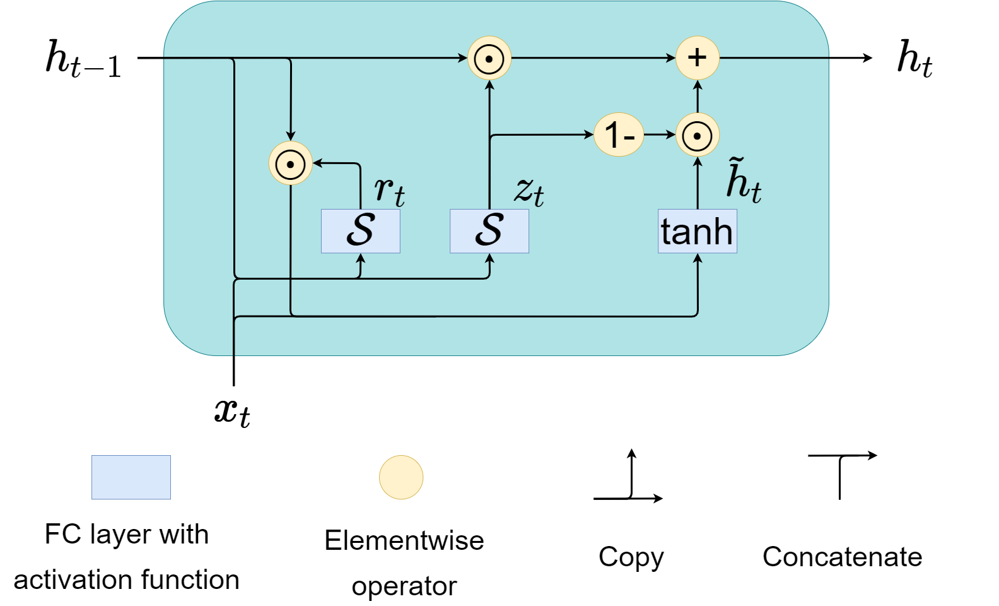
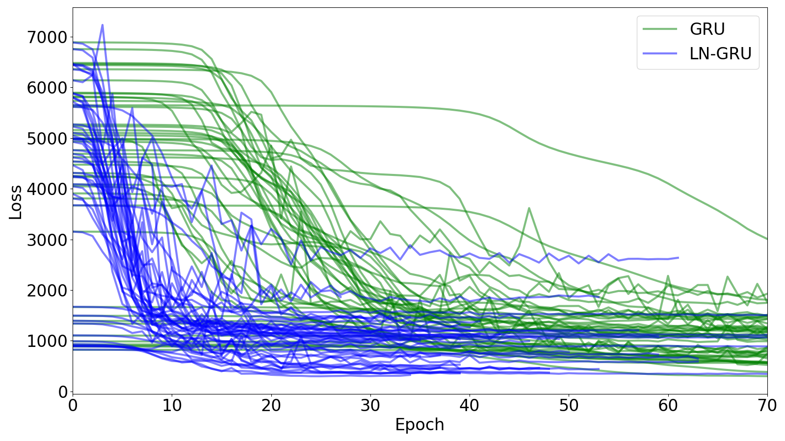

# LayerNorm GRU 
## Table of contents
- [Introduction and environment](#Introduction-and-environment) <br>
- [Why we need LayerNorm](#Why-we-need-LayerNorm) <br>
- [What is LayerNorm in GRU](#What-is-LayerNorm-in-GRU) <br>
- [How does it improve our model](#How-does-it-improve-our-model) <br>
- [References](#References) <br>

## Introduction and environment
* Implement layer normalization GRU in pytorch, followed the instruction from the paper [Layer normalization](https://arxiv.org/abs/1607.06450).
* Code modified from [this repository](https://github.com/seba-1511/lstms.pth/blob/master/lstms/lstm.py).
* Our research has exerted this technique in predicting kinematic variables from invasive brain-computer interface (BCI) dataset, [Nonhuman Primate Reaching with Multichannel Sensorimotor Cortex Electrophysiology](https://zenodo.org/record/583331). For more information regarding this dataset, please see the article [Superior arm-movement decoding from cortex with a new, unsupervised-learning algorithm](https://iopscience.iop.org/article/10.1088/1741-2552/aa9e95/meta).
* Environment: [Official pytorch docker image](https://hub.docker.com/r/pytorch/pytorch/tags) from [Docker Hub](https://hub.docker.com/) ```pytorch/pytorch:1.4-cuda10.1-cudnn7-runtime```

## Why we need LayerNorm
Activation functions, such as tanh and sigmoid have saturation area, as showed the their first derivatives.
Sigmoid and hyperbolic tangent (tanh) | First derivatives
:-------------------------:|:-------------------------:
  | 

For the values outside (-4, +4), the output will be very close to zero, and their gradients might also vanish, incurring the gradient vanishing problem.  

## What is LayerNorm in GRU
The structure of a GRU cell 
<!--   -->

has two tanh and one sigmoid function. 
The following show the mathematical equations for original GRU and LayerNorm GRU.

Original GRU              | LayerNorm GRU
:------------------------:|:-------------------------:
  | 

For more insight, where we simulate two extreme distributions of data and show the before and after effect of LayerNorm.
Before LayerNorm          | After LayerNorm
:------------------------:|:-------------------------:
  | 

After passing them into LayerNorm, the new distributions lie inside (-4, +4), perfect working area for activation functions.

## How does it improve our model
The result from one of my GRU models in BCI.
<!--  -->


## References
Ba, Jimmy Lei, Jamie Ryan Kiros, and Geoffrey E. Hinton. "Layer normalization." arXiv preprint arXiv:1607.06450 (2016)